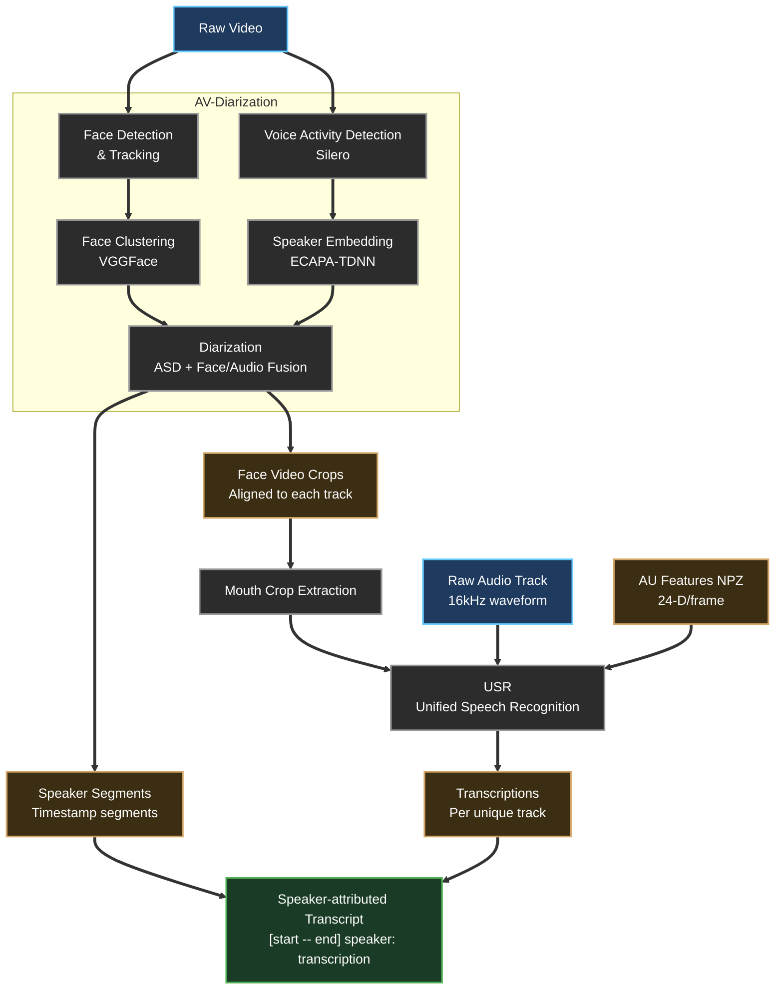
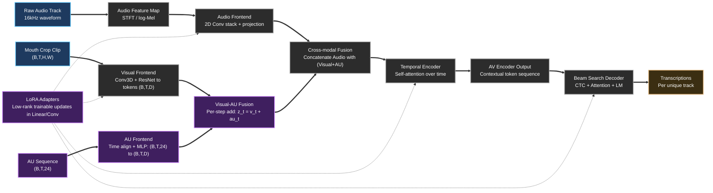

# AVATAR: Audio-Visual Attribution Transcription And Recognition

## Pipeline Overview

## USR Block Detail

Temporal intuition:
- `Conv3D` already mixes nearby frames, then emits a sequence of visual tokens `[v_1..v_T]`.
- AU is also a sequence, aligned to the same timeline (`T`), then projected.
- Fusion is timestep-wise (`z_t = v_t + au_t`), but the model still sees the full sequence `[z_1..z_T]`.
- Transformer layers then model long-range temporal dependencies across these fused tokens.

Notation:
- `D` = feature width (embedding dimension) of each timestep token used by the encoder.
