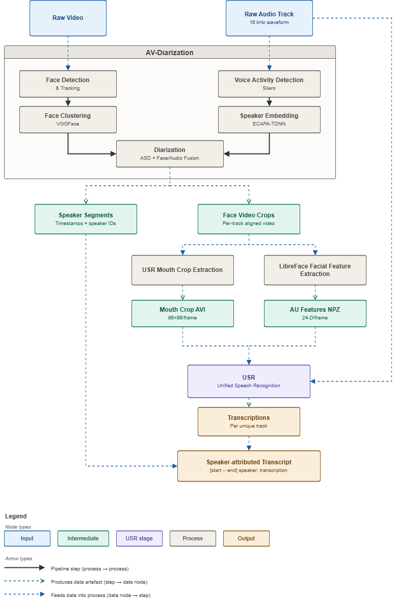
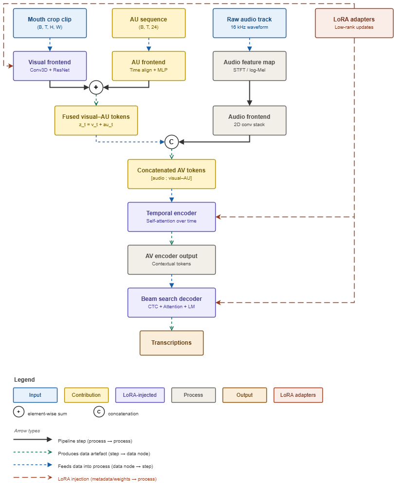

# AVATAR: Audio-Visual Attribution Transcription And Recognition

AVATAR is an end-to-end pipeline that takes a raw video with multiple speakers and produces a **speaker-attributed transcript** — each utterance labelled with *who spoke when* and *what they said*.

```
[0.00s - 3.42s] speaker_01: Hello everyone and welcome to today's presentation
[3.42s - 7.88s] speaker_02: Thank you for having me, I'm excited to be here
[7.88s - 12.15s] speaker_01: Let's start with the quarterly results
```

The system combines **audio-visual speaker diarization** (face detection, voice activity detection, face clustering, speaker embedding, and active speaker detection) with a **Unified Speech Recognition (USR)** model that fuses mouth-crop video, raw audio, and facial Action Unit (AU) features through LoRA-injected transformer blocks.

---

## Pipeline Overview



The pipeline operates in three stages:

1. **AV-Diarization** — Processes raw video through parallel visual (face detection & tracking, VGGFace clustering) and audio (Silero VAD, ECAPA-TDNN speaker embedding) streams, fused by Active Speaker Detection (ASD) to produce per-speaker timestamp segments and face video crops.

2. **Mouth Crop Extraction** — Aligned face video crops are processed to extract mouth regions (96×96/frame) using facial landmark detection, while facial Action Unit features (24-D/frame) are extracted via LibreFace.

3. **USR (Unified Speech Recognition)** — Mouth crops, raw audio waveform, and AU features are fed into a multi-modal transformer that produces per-track transcriptions, assembled with diarization timestamps into the final speaker-attributed transcript.

---

## USR Architecture



The USR model is a multi-modal speech recognition transformer with:

- **Visual Frontend** — Conv3D + ResNet processing of mouth crop clips (B, T, H, W) into visual token sequences.
- **Audio Frontend** — STFT/log-Mel spectrogram → 2D conv stack producing audio feature maps.
- **AU Frontend** — Time-aligned MLP projection of 24-D/frame Action Unit features.
- **V+AU Fusion** — Element-wise sum of visual and AU tokens at each timestep: `z_t = v_t + au_t`.
- **Cross-modal Fusion** — Concatenation of audio and visual–AU token sequences.
- **Temporal Encoder** — Self-attention transformer modelling long-range temporal dependencies.
- **Beam Search Decoder** — CTC + Attention + Language Model decoding with SentencePiece Unigram tokenizer (1k vocab).

Key components (Visual Frontend, Temporal Encoder, Decoder) are **LoRA-injected**, enabling parameter-efficient fine-tuning.

---

## Key Features

- **Audio-visual diarization** — Leverages both face tracks and voice embeddings for robust who-spoke-when attribution; outperforms audio-only diarization on visible speakers.
- **Action Unit fusion** — AU features (24-D/frame) extracted by LibreFace are fused into the visual stream, enriching the representation with facial expression cues.
- **LoRA-efficient fine-tuning** — Parameter-efficient low-rank adaptation of key transformer blocks enables task-specific tuning without full model retraining.
- **On-screen DER headline: 37.20%** on AVA-AVD test (2-clip tuning subset), with 83.6% of on-screen speech captured.
- **Modular design** — Each stage (diarization, mouth crop, transcription) can be run independently or swapped.
- **Output formats** — Plain text transcript (`.txt`) and subtitle format (`.srt`).

---

## Installation

### Prerequisites

- Python 3.10+
- PyTorch 2.0+ (CUDA recommended)
- FFmpeg
- Conda (recommended for managing the USR subprocess environment)

### Setup

```bash
# Clone the repository
git clone https://github.com/your-username/AVATAR.git
cd AVATAR

# Create and activate the main environment
python -m venv .venv
source .venv/bin/activate

# Install AVATAR (eval extras optional)
pip install -e .
pip install -e ".[eval]"

# Create a separate environment for USR (due to ESPnet/Fairseq dependency conflicts)
conda create -n usr_env python=3.10
conda activate usr_env
pip install -r models/usr/requirements.txt
```

Place pretrained model checkpoints in `pretrained_models/` and configure paths via environment variables as needed.

---

## Usage

### Quick Start

```python
from src.pipeline import Pipeline

pipeline = Pipeline(
    video_path="path/to/video.mp4",
    device=torch.device("cuda"),
)
results = pipeline.run()
```

### Command-line evaluation

```bash
# AVA-AVD diarization evaluation
python scripts/eval_diarization.py

# LRS2 fusion evaluation (USR-per-clip vs pipeline-on-concat)
python scripts/eval_lrs2_fusion.py

# Render demo video with face boxes and captions
python -m src.evaluation.render_demo \
    --video path/to/video.mp4 \
    --rttm path/to/result.rttm \
    --output demo.mp4
```

### Environment knobs

| Variable | Default | Description |
|----------|---------|-------------|
| `AVATAR_SPK_THRES` | 0.4 | Speaker embedding cosine-sim threshold for audio-only fallback |
| `AVATAR_DIST_THRES` | 0.5 | Face cluster merge distance threshold |
| `AVATAR_OVL_PENALTY` | 100 | Time-overlap penalty in agglomerative clustering |
| `AVATAR_POSTMERGE_THRES` | 1.0 | Cosine threshold for embedding-only post-merge (≥1.0 disables) |
| `AVATAR_SILERO_THRESHOLD` | 0.5 | Silero VAD speech probability threshold |
| `AVATAR_SILERO_MIN_SPEECH_MS` | 250 | Silero VAD minimum speech duration |
| `AVATAR_FORCE_CPU` | 0 | Force CPU even when CUDA is available |
| `AVATAR_USR_PYTHON` | — | Path to USR subprocess Python binary |

---

## Evaluation Results

### AVA-AVD Diarization (on-screen, UEM-restricted)

Scored on a 2-clip tuning subset of AVA-AVD test (0.25s collar).

| Video | Ref dur (s) | DER (%) | Miss (%) | FA (%) | Conf (%) |
|-------|------------|---------|---------|-------|---------|
| 1j20qq1JyX4_c_01 | 25.6 | **17.49** | 10.15 | 4.45 | 2.89 |
| 2qQs3Y9OJX0_c_01 | 28.9 | 56.91 | 22.62 | 22.61 | 11.67 |
| **Macro** | — | **37.20** | 16.39 | 13.53 | 7.28 |

**83.6% of on-screen speech is captured** by the AV diarizer. Full results and knob sweeps in [`reports/eval/diarization_results.md`](reports/eval/diarization_results.md).

### LRS2 Fusion Evaluation

The system is evaluated by comparing two conditions on synthetic multi-speaker samples (concatenated LRS2 clips):
- **USR-per-clip (oracle):** USR run independently on each source clip.
- **Pipeline-on-concat (unit under test):** Full pipeline on the stitched sample.

---

## Reproducing Results

```bash
# Build GT-based on/off-screen split
python -m src.evaluation.filter_onscreen_gt \
    --avaavd-root /path/to/AVA-AVD \
    --local-ref-dir data/eval/rttms_clip \
    --out data/eval/rttms_split_gt

# Run evaluation scripts
bash .score_onscreen_uem.sh
python scripts/eval_lrs2_fusion.py
```

---

## Project Structure

```
AVATAR/
├── src/                        # Core source code
│   ├── pipeline.py             # Main orchestrator
│   ├── diarization/            # AV-diarization (voxconverse wrapper)
│   ├── preprocess/             # Mouth crop extraction
│   ├── transcription/          # USR transcription
│   └── evaluation/             # Scoring, RTTM post-processing, demo rendering
├── models/
│   ├── usr/                    # Unified Speech Recognition (ESPnet/Fairseq)
│   └── av-diarization/         # Vendored voxconverse diarization
├── configs/eval/               # Evaluation configuration
├── scripts/                    # Training/evaluation entry points
├── tests/                      # Unit and integration tests
├── data/                       # Datasets, manifests, evaluation artifacts
├── reports/eval/               # Evaluation reports and rendered demos
└── pretrained_models/          # Pretrained model checkpoints
```

---

## License

MIT License. Copyright (c) 2026 BaoNguyenHoang.

---

## Citation

If you use AVATAR in your research, please cite:

```bibtex
@software{avatar2026,
  author = {BaoNguyenHoang},
  title = {AVATAR: Audio-Visual Attribution Transcription And Recognition},
  year = {2026},
  url = {https://github.com/BaoNguyenHoang/AVATAR}
}
```
