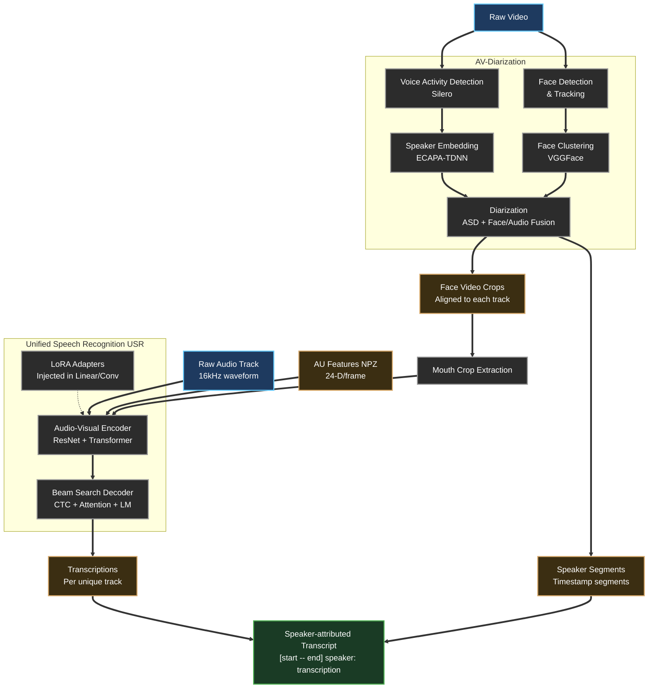

# AVATAR: Audio-Visual Attribution Transcription And Recognition

## Pipeline Overview

```mermaid
graph TD
    %% ==========================================
    %% DARK MODE STYLES (No class assignment to avoid parser errors)
    %% ==========================================
    classDef input fill:#1e3a5f,stroke:#66ccff,stroke-width:2px,color:#fff;
    classDef process fill:#2c2c2c,stroke:#999999,stroke-width:2px,color:#fff;
    classDef data fill:#3b2e12,stroke:#d4a566,stroke-width:2px,color:#fff;
    classDef output fill:#1a3b25,stroke:#4caf50,stroke-width:2px,color:#fff;

    %% NODES (Quotes + <br/> for guaranteed line breaks)
    RV["Raw Video"]:::input
    RA["Raw Audio Track<br/>16kHz waveform"]:::input
    AU["AU Features NPZ<br/>24-D/frame"]:::data

    subgraph AVD [AV-Diarization]
        FD["Face Detection<br/>& Tracking"]:::process
        VAD["Voice Activity Detection<br/>Silero"]:::process
        FC["Face Clustering<br/>VGGFace"]:::process
        SE["Speaker Embedding<br/>ECAPA-TDNN"]:::process
        DI["Diarization<br/>ASD + Face/Audio Fusion"]:::process
    end

    SS["Speaker Segments<br/>Timestamp segments"]:::data
    FVC["Face Video Crops<br/>Aligned to each track"]:::data
    MCE["Mouth Crop Extraction"]:::process

    subgraph USR [Unified Speech Recognition USR]
        ENC["Audio-Visual Encoder<br/>ResNet + Transformer"]:::process
        DEC["Beam Search Decoder<br/>CTC + Attention + LM"]:::process
        LORA["LoRA Adapters<br/>Injected in Linear/Conv"]:::process
    end

    TR["Transcriptions<br/>Per unique track"]:::data
    FO["Speaker-attributed Transcript<br/>[start -- end] speaker: transcription"]:::output

    %% CONNECTIONS (Using ==> for thicker lines, -.-> for dashed LoRA injection)
    RV ==> FD
    RV ==> VAD
    FD ==> FC
    VAD ==> SE
    FC ==> DI
    SE ==> DI
    
    DI ==> SS
    DI ==> FVC
    FVC ==> MCE
    
    MCE ==> ENC
    RA ==> ENC
    AU ==> ENC
    ENC ==> DEC
    LORA -.-> ENC
    
    DEC ==> TR
    SS ==> FO
    TR ==> FO
```
